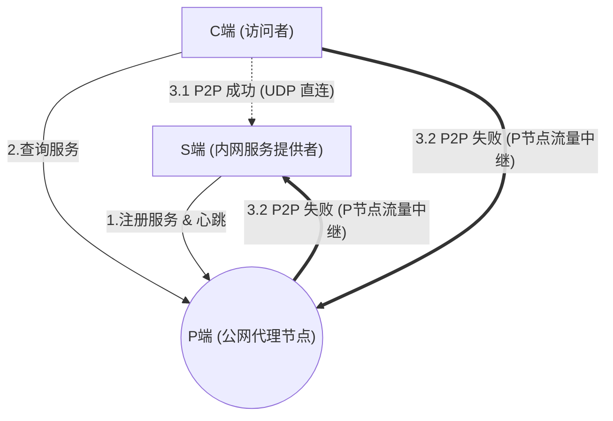

# udroute 🚀

**udroute** 是一款基于 .NET 10 开发的高性能、跨平台 UDP P2P 打洞与中继隧道工具。它旨在帮助用户轻松穿透 NAT 网络，将内网的 TCP/UDP 服务安全、稳定地暴露或映射到外部环境。无论您是需要极低延迟的游戏联机，还是可靠的内网穿透访问，udroute 都能为您提供完美的解决方案。

## 🌟 核心特性 (Key Features)

* **⚡ P2P 智能穿透与中继 (Smart P2P & Relay)**：C 端与 S 端优先尝试直接进行 UDP 打洞建立 P2P 直连通道；若网络环境复杂无法直连，系统会自动回退到 P 端（Proxy）进行高效流量中继。
* **🛠️ 多协议支持 (TCP/UDP over UDP)**：
  * **纯 UDP 模式**：原生数据报零拷贝直传，适用于对实时性要求极高的应用。
  * **TCP over KCP 模式**：内置 KCP 协议引擎，将内网 TCP 流量封装为 UDP 传输。支持自定义 KCP 窗口、NoDelay 等参数，在弱网环境下大幅降低延迟并保证数据可靠性。
* **🔒 动态安全鉴权 (Dynamic Authentication)**：内置热重载文件监控和密码安全哈希机制。支持 `strict`（严格）、`optional`（可选）和 `none`（无）三种服务端注册鉴权模式，防范未授权的端口占用。

## 🏗️ 架构说明 (Architecture)

udroute 的网络拓扑包含三种核心角色，您可以通过同一套可执行文件，通过不同的配置文件来决定扮演的角色：

1. **[P] 代理节点 (Proxy Mode)**：拥有公网 IP 的服务器。负责接收 S 端的注册、处理 C 端的寻址查询，并在无法进行 P2P 打洞时充当数据中继。
2. **[S] 服务端 (Server Mode)**：内网中提供真实服务（如 RDP、SSH、游戏服务器）的节点。它会主动向 P 端注册自己的服务名称，并保持 KeepAlive。
3. **[C] 客户端 (Client Mode)**：访问者节点。它会在本地监听一个端口，当用户连接该端口时，C 端会向 P 节点查询 S 端的真实地址，并发起打洞或中继请求，最后建立透明的数据隧道。



## 📦 编译与运行 (Build & Run)

### 环境要求
* [.NET 10 SDK](https://dotnet.microsoft.com/download/dotnet/10.0) 或更高版本

### 编译源码 (Native AOT)
本项目推荐使用 **Native AOT** 模式发布，编译后的可执行文件体积极小、启动极快，且无需目标机器安装任何 .NET 运行时环境。

**1. Windows (x64)**
> 编译前需确保已安装 Visual Studio 的“使用 C++ 的桌面开发”工作负载。
```bash
git clone https://github.com/yourusername/udroute.git
cd udroute
dotnet publish UDRoute/UDRoute.csproj -c Release -r win-x64 /p:PublishAot=true
```

**2. Linux (以 WSL + Alpine 为例)**
> Alpine 环境基于 `musl` libc，因此需要使用 `linux-musl-x64` 的运行时进行编译。项目中已包含专用的发布脚本 `publish`。
```bash
# 1. 在 Alpine 终端中安装 bash、curl 以及 AOT 编译所需的 C++ 依赖链
sudo apk add bash curl clang build-base zlib-dev

# 2. 下载官方安装脚本并安装 .NET 10 SDK
curl -sSL https://dot.net/v1/dotnet-install.sh -o dotnet-install.sh
bash ./dotnet-install.sh -c 10.0

# 3. 将 dotnet 环境变量写入 profile 并使其立即生效
echo 'export DOTNET_ROOT=$HOME/.dotnet' >> ~/.profile
echo 'export PATH=$PATH:$HOME/.dotnet' >> ~/.profile
source ~/.profile

# 4. 切换到代码目录，使用项目自带的脚本一键发布为极其精简的静态可执行文件
cd udroute/UDRoute
sh publish
```
该脚本会自动开启 `StaticExecutable=true` 和 `InvariantGlobalization=true` 以最大程度减小文件体积。编译成功后，独立的可执行文件将生成在 `UDRoute/bin/Release/net10.0/publish/linux-x64/` 目录中。

### 运行方式
直接运行编译出的程序并指定配置文件（程序默认读取运行目录下的 `udroute.ini`）：
```bash
./udroute -c config_server.ini
```

## ⚙️ 配置文件示例 (Configuration)

配置采用简单直观的 INI 格式，以下是典型的使用场景。注意：**全局配置无需带 `[段名]` 标记**。

### 1. 部署公网 Proxy (P端)
创建一个名为 `proxy.ini` 的文件：
```ini
DevName=PublicNode      ; 节点名称
Port=7000               ; 监听端口
AuthMode=strict         ; 开启严格鉴权 (要求 S 端必须提供正确的帐号密码)
```
> *注：开启 strict 鉴权后，会在同目录下自动生成 `proxy.pwd` 密码文件。你可以在其中直接写入明文 `user:pass` 格式，程序会自动热重载并将其转换为哈希加密存储。*

### 2. 部署内网 Server (S端)
创建一个名为 `server.ini` 的文件，将本地的 3389 (RDP) 暴露出去：
```ini
DevId=11111111-2222-3333-4444-555555555555  ; 必须是合法的 GUID (未填写程序首次运行会自动生成)
Username=myuser         ; P端的注册账号
Password=mypass         ; P端的注册密码

[RemoteDesktop]         ; 中括号内为要暴露的目标服务名称 (供 Client 检索)
target=127.0.0.1:3389/tcp  ; 想要暴露的本地服务 IP、端口及协议
server=p.example.com       ; P端的公网IP或域名
kcp=fast                   ; 可选：针对远程桌面的低延迟 KCP 预设优化
```

### 3. 部署访问 Client (C端)
创建一个名为 `client.ini` 的文件，将 S 端暴露的服务映射到本地。
客户端端口映射属于全局规则，直接写在文件开头，语法为 `本地端口/协议 = 目标服务名@代理服务器地址`：
```ini
;; 将本地的 13389 端口转发到远程的 RemoteDesktop 服务
13389/tcp = RemoteDesktop@p.example.com
```
运行后，客户端用户只需连接本地的 `127.0.0.1:13389`，即可穿透访问到远端的 3389 端口。

## 🛠️ 守护进程与服务管理 (Service Management)

udroute 内置了跨平台的系统后台服务自动注册功能。无论是 Windows 的服务控制器还是 Linux 的 `systemd`，都能一键搞定后台守护与开机自启。

### 一键安装与启动
通过 `-i [服务名称]` 参数即可将应用注册为系统服务。程序会自动为您创建一个与服务同名的 `[服务名称].ini` 配置模板（如果不存在），并绑定启动。
```bash
# 需在管理员权限 / Root 环境下执行
# 此命令将安装一个名为 udroute_p 的服务，并读取 udroute_p.ini 配置
./udroute -i udroute_p
```
> **💡 高级技巧**：您可以注册多个名称不同的服务（例如 `./udroute -i srv1` 和 `./udroute -i srv2`），从而在同一台机器上完美共存多份相互独立的 udroute 实例进程！

### 卸载服务
使用 `-u [服务名称]` 即可安全停止并彻底移除系统服务：
```bash
./udroute -u udroute_p
```

### 动态状态查询
既然服务在后台静默运行，如何知道它现在的工作情况？udroute 内置了基于命名管道（Named Pipes）的 IPC 状态报告机制。任何时候，只需在命令行执行：
```bash
./udroute -status
```
即可实时拉取所有正在运行的 udroute 实例的状态报告，包括已注册的服务列表、当前活跃的穿透/中继隧道、双端的公网 IP 以及实时的 RTT 延迟数据。

## 🤝 贡献与反馈 (Contributing)

欢迎提交 Issue 或 Pull Request！
无论是网络协议的优化建议，还是 NAT 穿透成功率的提升方案，我们都非常期待您的参与。

## 📄 许可证 (License)

本项目采用 MIT 许可协议。

