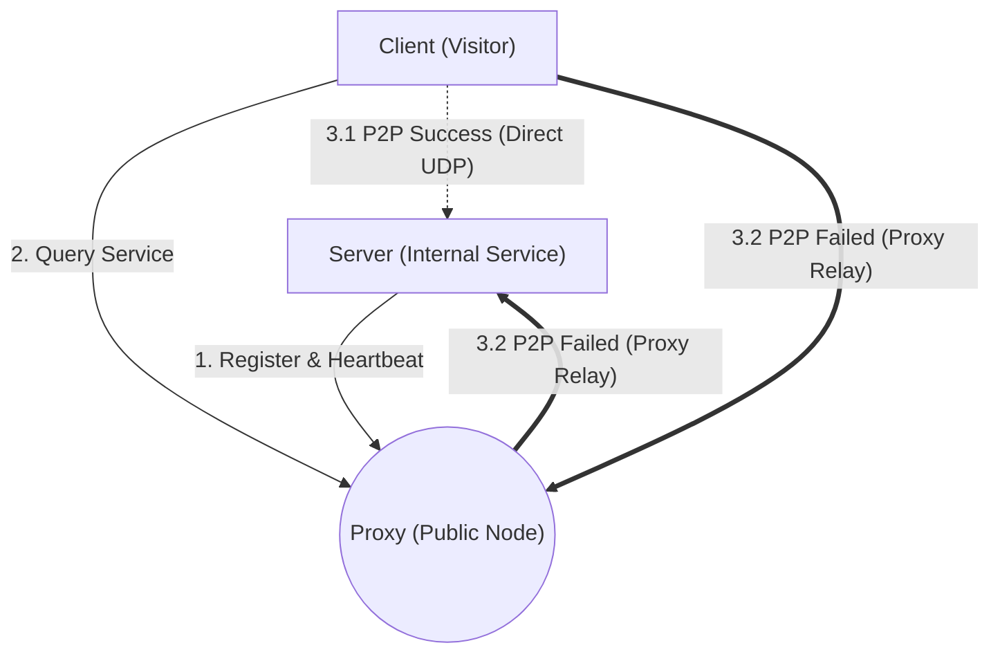

# udroute 🚀

[English](README_en.md) | [简体中文](README.md)

**udroute** is a high-performance, cross-platform UDP P2P hole-punching and relay tunnel tool built on .NET 10. It is designed to effortlessly traverse NAT networks, securely and stably exposing or mapping your internal TCP/UDP services to the outside world. Whether you need ultra-low latency for gaming or reliable intranet access, udroute provides a perfect solution.

**This project is compiled into a native application using AOT and does not require the .NET runtime.**

## 🌟 Key Features

* **⚡ Smart P2P & Relay**: The Client and Server prioritize direct UDP hole-punching to establish a P2P connection. If complex network topologies prevent direct connection, the system seamlessly falls back to the Proxy node for efficient traffic relay.
* **🛠️ Multi-Protocol (TCP/UDP over UDP)**:
  * **Pure UDP Mode**: Native datagram zero-copy pass-through, ideal for applications requiring absolute real-time performance.
  * **TCP over KCP Mode**: Built-in KCP protocol engine encapsulates internal TCP traffic over UDP. Supports custom KCP parameters (e.g., NoDelay, Window Size) to drastically reduce latency and ensure reliability in poor network conditions.
* **🔒 Dynamic Authentication**: Features hot-reloading file monitoring and secure password hashing. Supports `strict`, `optional`, and `none` authentication modes for server registration, preventing unauthorized port occupation.
* **🔀 Port Multiplexing**: The Server [S], Client [C], and Proxy [P] modes can be enabled simultaneously in a single application instance, sharing the exact same underlying local UDP port to maximize system resource efficiency.
* **🚀 Extreme Performance**: Leveraging the latest .NET 10 features, the underlying network communication relies on `ZeroCopyUdpSocket`, `ArrayPool<byte>`, and `ReadOnlySpan/Memory` to achieve zero-allocation data forwarding, entirely rejecting GC-induced stutters.

## 🏗️ Architecture

The network topology of udroute consists of three core roles. You can determine which role the executable assumes using different configuration files:

1. **[P] Proxy Mode**: A server with a public IP. It handles Server registrations, processes Client address queries, and acts as a data relay when P2P hole-punching is not possible.
2. **[S] Server Mode**: A node within a private network providing actual services (e.g., RDP, SSH, Game Server). It proactively registers its service name with the Proxy and maintains a KeepAlive heartbeat.
3. **[C] Client Mode**: The visitor node. It listens on a local port. When a user connects to this port, the Client queries the Proxy for the Server's real address, initiates a hole-punch or relay request, and establishes a transparent data tunnel.



## 🌍 Public Test Server

To help users quickly get started and test the application, a public Proxy ([P] Node) server has been provisioned:
* **Server Address**: `www.qzsoft.top`
* **Instructions**: This server allows connections **without authentication**, but to prevent abuse, **the traffic relay (forwarding) feature has been disabled**.
* **Use Cases**: Ideal for temporary testing or experiencing UDP P2P direct hole-punching. If your network topology is highly complex and P2P hole-punching fails, the connection will drop instead of falling back to relay mode. In such scenarios, it is recommended to deploy your own Proxy server.

## 📦 Build & Run (Native AOT)

It is highly recommended to publish this project using **Native AOT**. The compiled executable is incredibly small, starts instantly, and does not require the target machine to have the .NET runtime installed.

### 1. Windows (x64)
> Make sure the "Desktop development with C++" workload is installed in Visual Studio before compiling.
```bash
git clone https://github.com/yourusername/udroute.git
cd udroute
dotnet publish UDRoute/UDRoute.csproj -c Release -r win-x64 /p:PublishAot=true
```

### 2. Linux (e.g., WSL + Alpine)
> Alpine environments use `musl` libc, so compilation requires the `linux-musl-x64` runtime. The project includes the official `dotnet-install.sh` and a dedicated `publish` script.
```bash
# 1. Install bash, curl, and the C++ dependency chain required for AOT in the Alpine terminal
sudo apk add bash curl clang build-base zlib-dev

# 2. Download the official install script and install the .NET 10 SDK
curl -sSL https://dot.net/v1/dotnet-install.sh -o dotnet-install.sh
bash ./dotnet-install.sh -c 10.0

# 3. Export dotnet environment variables to profile and apply them
echo 'export DOTNET_ROOT=$HOME/.dotnet' >> ~/.profile
echo 'export PATH=$PATH:$HOME/.dotnet' >> ~/.profile
source ~/.profile

# 4. Switch to the source directory and use the included script to publish a highly compact static executable
cd udroute/UDRoute
sh publish
```
This script automatically enables `StaticExecutable=true` and `InvariantGlobalization=true` to maximize size reduction. Upon success, the standalone executable will be generated in the `UDRoute/bin/Release/net10.0/publish/linux-x64/` directory.

## ⚙️ Configuration Examples

Configuration uses a simple and intuitive INI format. Note: **Global configuration items do not require a `[SectionName]` tag.**

### 1. Deploy Public Proxy ([P] Node)
Create a file named `proxy.ini`:
```ini
DevName=PublicNode      ; Node name
Port=7000               ; Listening port
AuthMode=strict         ; Enable strict authentication (S nodes must provide correct credentials)
```
> *Note: Enabling strict authentication will automatically generate a `proxy.pwd` file in the same directory. You can write credentials in plain text (e.g., `user:pass`) there; the program will hot-reload and convert them into hashed secure storage automatically.*

### 2. Deploy Internal Server ([S] Node)
Create a file named `server.ini` to expose a local Remote Desktop (3389):
```ini
DevId=11111111-2222-3333-4444-555555555555  ; Must be a valid GUID (auto-generated on first run if empty)
Username=myuser         ; Registered username on the P node
Password=mypass         ; Registered password on the P node

[RemoteDesktop]            ; The target service name in brackets (for Client retrieval)
target=127.0.0.1:3389/tcp  ; The local service IP, port, and protocol to expose
server=p.example.com       ; The P node's public IP or domain
kcp=fast                   ; Optional: KCP preset optimized for low-latency Remote Desktop
```

### 3. Deploy Visitor Client ([C] Node)
Create a file named `client.ini` to map the exposed service to the local machine.
Client port mappings are global rules written directly at the top of the file. Syntax: `LocalPort/Protocol = TargetServiceName@ProxyAddress`:
```ini
;; Forward local port 13389 to the remote 'RemoteDesktop' service
13389/tcp = RemoteDesktop@p.example.com
```
After running, the client user simply connects to `127.0.0.1:13389` locally to tunnel through and access the remote 3389 port.

### 4. File Service & Direct Transfer
In addition to TCP/UDP port forwarding, udroute features a built-in lightweight file transfer sub-protocol:
- **Server File Sharing**:
  Expose a directory by specifying `target=C:\Data\Shared;/file` in the configuration file, or directly via command-line quick setup:
  ```bash
  udroute my_files=C:\Data\Shared;/file@p.example.com
  ```
  *(Optional: append `;readonly` to prevent modifications, e.g., `target=C:\Data\Shared;/file;readonly`)*
- **Client Push (Upload)**:
  ```bash
  udroute -push [-y] my_files[:password]@p.example.com remote_path/file.zip local_file.zip
  ```
- **Client Pull (Download)**:
  ```bash
  udroute -pull [-y] my_files[:password]@p.example.com remote_path/file.zip local_file.zip
  ```
- **Overwrite Protection & Pipe Mode**:
  - If the destination file already exists, udroute prompts for interactive confirmation `(y/N)`; add `-y` to overwrite directly without confirmation.
  - Supports using `con:` as the local file path to pipe data to/from `stdin` or `stdout` (in pipe mode, `-y` is required if overwriting an existing remote file).

## 🛠️ Service Management (Daemon)

udroute features cross-platform automatic registration for system background services. Whether you use the Windows Service Controller (`sc`) or Linux `systemd`, background daemonization and auto-start on boot are just one command away.

### One-Click Install & Start
Use the `-i [ServiceName]` parameter to register the application as a system service. The program will automatically create a configuration template named `[ServiceName].ini` (if it doesn't exist) and bind it to the service.
```bash
# Must be executed with Administrator / Root privileges
# This command installs a service named udroute_p and loads the udroute_p.ini config
./udroute -i udroute_p
```
> **💡 Pro Tip**: You can register multiple services with different names (e.g., `./udroute -i srv1` and `./udroute -i srv2`) to perfectly co-exist multiple independent udroute instances on the same machine!

### Uninstall Service
Use `-u [ServiceName]` to safely stop and thoroughly remove the system service:
```bash
./udroute -u udroute_p
```

### Dynamic Status Query
Since the service runs silently in the background, how do you check its operational status? udroute features an IPC status reporting mechanism based on Named Pipes. At any time, simply execute in the command line:
```bash
./udroute -status
```
This will pull a real-time status report from all running udroute instances, including registered services, currently active hole-punching/relay tunnels, public IPs of both endpoints, and real-time RTT latency data.

## 🤝 Contributing

Issues and Pull Requests are always welcome!
Whether it's network protocol optimization suggestions or solutions to improve the NAT hole-punching success rate, we look forward to your participation.

## 📄 License

This project is licensed under the MIT License.

